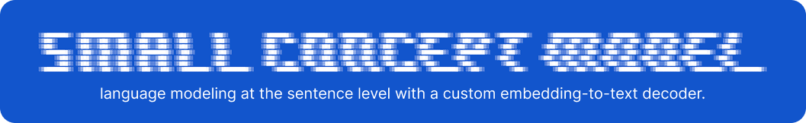
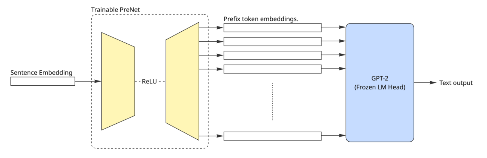
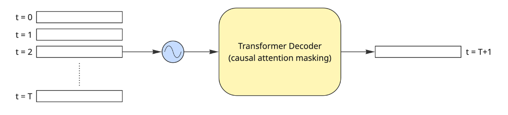

<div align="center">
    
</div>

Working prototype for a Small Concept Model (SCM) based on Meta's Large Concept Model (LCM), with a custom embedding decoder for vec-to-text conversion.

---

On the root of this project, you can find:
* `train_inversion.ipynb`, a notebook that trains an embedding inversion model based on prefix tuning. By default, it trains a _PreNet_ to invert _paraphrase-multilingual-MiniLM-L12-v2_ sentence-level embeddings.

<figure align="center">
    
    <figcaption>Scheme of the architecture of the embedding inversion model.</figcaption>
</figure>

* `train_scm.ipynb`, a notebook that trains the actual autoregressive small concept model (SMC), a decoder-only transformer inspired by Meta's _BaseLCM_ designed for next-embedding prediction.
> For a more faithful straightforward reproduction of _BaseLCM_, take a look at [this implementation](https://www.youtube.com/watch?v=2ZLd0uZvwbU).

<figure align="center">
    
    <figcaption>High-level scheme of the Small Concept Model (SCM).</figcaption>
</figure>

* `inference_test.ipynb`, a notebook where you can run inference using pretrained weights. You can test both the embedding inversion model (trained on 1 million sentences from _BookCorpus_), and the SCM (trained on 100k sequences of 16 sentences each from _BookCorpus_).

Inside the `./small_concept_model` folder, you can find all the modules used to build models, load and pre-process datasets, and create the full pipleine.

---

## Streamlit App
In this repo you can also find a Streamlit app to interact with the pretrained language models for text generation. To use it, from the root of the project run:
```shell
streamlit run app.py
```


