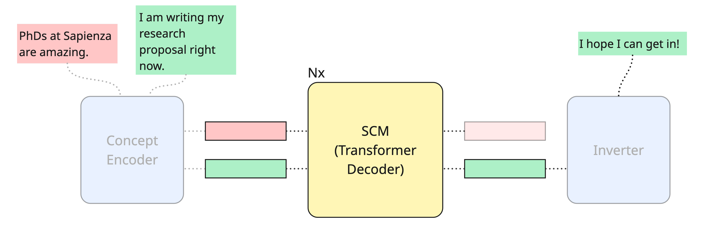

    

Working prototype for a Small Concept Model (SCM) based on Meta's Large Concept Model (LCM), with a custom embedding decoder for vec-to-text conversion.

---

On the root of this project, you can find:
* `embedding_space_exploration.ipynb`, a notebook that explores the multilingual $384$-dimensional embedding space generated by the _paraphrase-multilingual-MiniLM-L12-v2_ model from S-BERT.

* `train_inversion.ipynb`, a notebook that trains the embedding inversion model, formalized as a prefix-training problem.

<figure align="center">
    
    <figcaption>Scheme of the architecture of the embedding inversion model.</figcaption>
</figure>

* `train_scm.ipynb`, a notebook that trains the actual autoregressive small concept model (SCM) for next-concept prediction.
    > Code used for the actual SCM architecture (PreNet and PostNet layers) is inspired by [this implementation](https://www.youtube.com/watch?v=2ZLd0uZvwbU).

<figure align="center">
    
    <figcaption>High-level scheme of the Small Concept Model (SCM).</figcaption>
</figure>

Inside the `./small_concept_model` folder, you can find all the modules used to build models, load and pre-process datasets, and train the actual models.